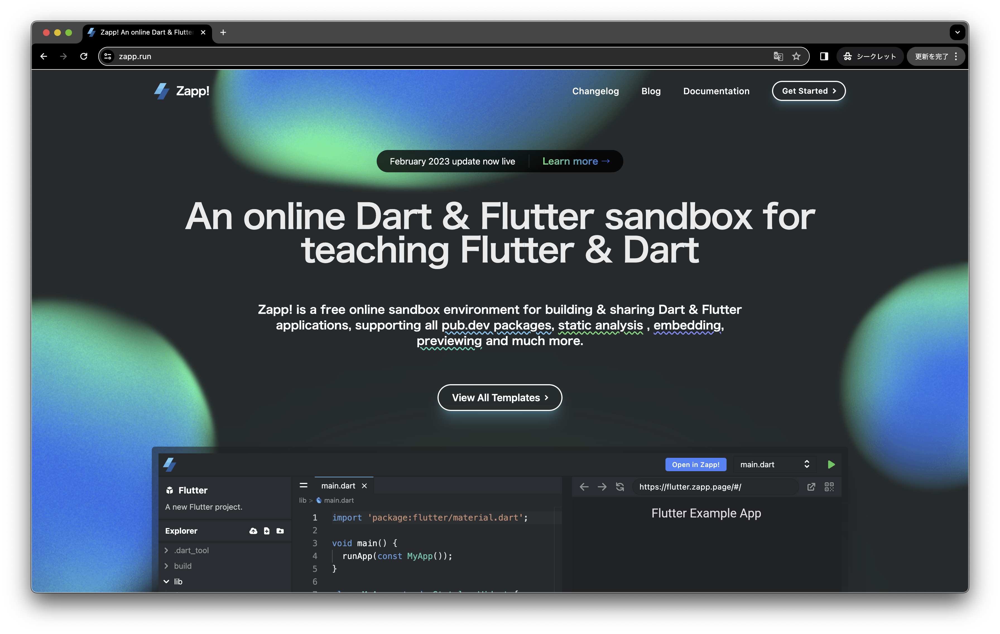

# 初めに

今回の勉強会では、Zapp! という Dart と Flutter のサンドボックスを使って Flutter 公式のチュートリアルをやっていきます。

Zapp! → https://zapp.run/  
公式チュートリアル → [初めての Flutter アプリ](https://codelabs.developers.google.com/codelabs/flutter-codelab-first?hl=ja#0)

# Flutter とは

Flutter とは、Google が提供するマルチプラットフォームアプリケーションを構築するためのフレームワークです。
開発言語として Dart を採用しています。

本来、iOS アプリは Swift、Android アプリは Kotlin、Web は JS、PC は C#、Java、Electron など、それぞれの環境で必要な言語・フレームワークが決まっています。
Flutter を使うと、これらすべてのプラットフォームに対応することができます。

**使用例**

- My BMW  
    
  出典：https://apps.apple.com/jp/app/my-bmw/id1519034860

- じゃらん  
  
  出典：https://apps.apple.com/jp/app/%E3%81%98%E3%82%83%E3%82%89%E3%82%93/id366264405

# Zapp! の使い方

Zapp! とは Web ベースの Dart や Flutter の開発ができるサンドボックスです。特に環境構築が必要ないためさくっと Dart や Flutter を書きたい方には便利なツールになっています（他にも公式が出している [DartPad](https://dartpad.dev/?) があります）。

では Zapp! を開いて Flutter を書くための準備をしましょう。下記画像の右上の「Get Started」をクリックしてください。  

選択画面が表示されるので、真ん中上の「Flutter」を選択してください。  

すると、エディターが表示されます。ここまでで準備完了です。  

## エディターの説明

エディターについてそれぞれ説明します。

### Explorer

Flutter Project のフォルダやファイルが表示されます。フォルダ/ファイルの追加や削除、開きたいファイルはここから選択します。  

### Search

ファイル検索で使います。  

### Changes

変更したファイルの差分（どのコードが追加/削除されたのか）が分かります。  

### Sandbox Environment

サンドボックスの環境です。「Download as zip file」から Flutter Project をダウンロードすることができます。ダウンロードした Flutter Project 使って VScode や Android Studio で開発することができます。  

### コードを記述する場所

Flutter のコードはここに書いていきます。補完が使えるためどんどん使ってください。「Logs」には `print()` 等を使った際の出力が表示されます。  

### 実行した結果

実行結果が表示されます。コードを変更し保存（mac なら `⌘`+`s`、Windows なら`ctrl`+`s` ）すると Flutter のホットリロード機能が働き変更を反映させた UI が表示されます。

